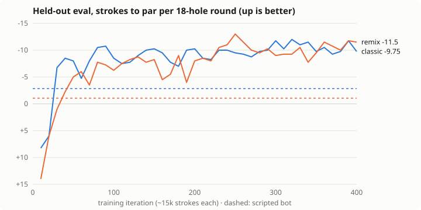
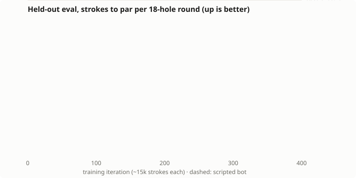

# Training

## Quick start

```sh
npm run build:sim                                 # the Rust env: golfsim/target/release/
pip install -r py/requirements.txt                # torch + numpy (CUDA torch for a GPU, see below)
npm test                                          # ~10 s: backprop, env contract, Rust-vs-JS parity
cd py
python -m golfrl.selftest                         # the PyTorch net is the browser's net
python -m golfrl.train --name myrun --iters 400   # GPU if available; Ctrl-C is safe after an eval
python -m golfrl.evaluate ../runs/myrun/best.json --rounds 20 --escape --card
cd ..
cp runs/myrun/best.json models/agent.json         # ship it
npm run build:web                                 # build/index.html, one self-contained file
```

`pip install -e py` makes `python -m golfrl.…` work from any directory.

Each run writes to `runs/<name>/`:

| File | Contents |
|---|---|
| `log.csv` | One row per iteration: training toPar per hole (the last 2000 holes), penalties, pickups, PPO losses, entropy, KL, clip fraction, grad norm, lr, strokes/s, and the eval columns when evaluated. The same columns as the JS trainer, so `npm run plot` reads it. |
| `best.json` | The checkpoint with the best mean of classic and remix eval to par, in the **JS format**: the browser, `rl/eval.mjs` and `rl/web/build.mjs` load it as is |
| `last.json` | The latest parameters, JS format |
| `last.pt` | Everything needed to continue: `--resume runs/<name>/last.pt --iters <new total>` |
| `config.json` | The exact arguments and device |

`--init models/agent.json` starts a new run from any JS-format checkpoint (fine-tuning).

## On the GPU machine

1. Rust from https://rustup.rs (on Windows it needs the MSVC build tools, which rustup offers to install), then `npm run build:sim`, or `cargo build --release` in `golfsim/`.
2. PyTorch with CUDA: pick the command for your CUDA version at https://pytorch.org/get-started/locally/, e.g. `pip install torch --index-url https://download.pytorch.org/whl/cu128`, then `pip install numpy`.
3. `python -m golfrl.selftest`, then train. The first line of the log says which device it is on (`--device cuda` forces it).

Where the time goes: the envs run on the CPU, one per core (~24k strokes/s on 16 cores), and the networks on the GPU. On a 16-core CPU alone, the defaults take ~1.4 s an iteration (0.7 s of play and 0.7 s of PPO update). A GPU removes most of the update, so the envs set the pace. More envs per iteration (`--envs 2048`) use a big GPU better, but they change the batch, so re-check `--lr` and `--target-kl`.

## Hyperparameters (defaults in `py/golfrl/train.py`)

| Flag | Default | Notes |
|---|---|---|
| `--envs` / `--steps` | 512 / 32 | Envs stepped in parallel, and strokes each plays per iteration: 16384 strokes an iteration, like the JS trainer's 15 × 1024. An episode still running at the end is bootstrapped from the critic and continues next iteration. |
| `--threads` | all cores | Env threads |
| `--epochs` / `--mb` | 4 / 4 | 16 Adam steps per iteration. The KL early stop (`--target-kl` 0.03 × 1.5) cuts epochs short. |
| `--lr` | 3e-4 | Linear decay to `--lr-final` × lr (0.1) |
| `--clip` | 0.2 | PPO ratio clip |
| `--ent-cat` / `--ent-cont` | 0.01 / 0 | Entropy bonus on the club/spin heads, and on the Gaussian heads |
| `--vf` | 0.5 | Critic loss weight (separate network) |
| `--gamma` / `--lambda` | 1 / 0.95 | Undiscounted: the return is minus the score |
| `--hidden` | 256,128 | Both actor and critic. The browser runs any size. |
| `--start-prob` | 0.3 | Share of episodes that start from a random playable spot on the hole (exploring starts) instead of the tee |
| `--classic-prob` | 0 | Share of training episodes on the classic course. It is 0 so classic stays a held-out test. |
| `--eval-every` / `--eval-rounds` | 10 / 4 | Deterministic 18-hole rounds on each eval set |
| `--device` | auto | `cuda` when available, else `cpu` |

The original pure-Node trainer (`npm run train`, `rl/train.mjs`) still works and takes the same PPO flags, with `--workers` in place of `--envs`. It is ~18× slower.

## Reading the log

- **`toPar/hole`** is the training score per hole with a stochastic policy, so it runs worse than eval. Multiply by 18 for a round.
- **`ent`** is the summed entropy. It goes negative once the Gaussian stds shrink below 1, which is expected as putting sharpens.
- **`gn`** is the grad norm before clipping at 0.5. Values of about 1–10 are normal here, because the gradient is clipped every step.
- **Eval** uses the argmax club and spin and the mean aim and distance, with swing noise on. It is typically 1–2 strokes per round better than training.
- **`sps`** is strokes per second over the whole iteration, play and update together.

## Results log

Newest first. Scores are strokes to par per 18-hole round. Rows before r4 are 4-round in-training evals (noisy, ±2–3 strokes), and r4, py1 and the baselines use 20 fresh rounds (`--from 4`). With `--escape` the stuck shots are sampled, so escape scores move by a few tenths between evaluations.

| Run | Obs | Iters (steps) | Classic | Remix | Notes |
|---|---|---|---|---|---|
| _baseline_ default shot | — | — | +7.25 | +12.80 | Action (0,0) with the game's club, which is the game's own default aim and target |
| _baseline_ scripted | — | — | −2.85 | −1.05 | The game's dev bot, `Golf13K/game/tools/sim.mjs`. Its wind is unseeded. |
| py1 | v3 | 400 (6.55M) | −10.85 | −8.70 | **The Python trainer on the Rust env**, CPU only: 11.6 minutes on 16 cores, against r4's 2.3 hours. Same recipe as r4 (lr 2.5e-4, 30% exploring starts). The final iteration is shown, evaluated by `golfrl.evaluate --escape`. Without escape −10.65 / −7.90, with 0.45 / 0.50 pickups. Evaluated the same way, r4 scores −10.20 / −9.05, so this is a tie, and r4 stays shipped. `best.json` (iter 200, picked on a lucky 4-round eval) scores −10.10 / −8.70. |
| **r4** | v3 | 400 (6.15M) | **−9.85** | **−9.40** | From scratch, lr 2.5e-4, 30% exploring starts, `--escape`. Without escape it scores −9.70 / −8.80, with 0.25 / 0.40 pickups per round. Shipped as `models/agent.json` (iter 390). |
| r3 | v2 | 70→103 | −7.0 | −5.75 | r2 resumed with exploring starts, lr 2e-4. Pickups remained on hairpins, where the pin-relative aim cannot follow the fairway. That motivated v3. |
| _(early)_ pin-aim naive | — | — | +27.3 | +41.5 | The game's club straight at the pin (rounds 0–3). Obsolete under v3. |
| r2 | v2 | 77 (1.19M) | −6.5 | −4.25 | Tee starts only. Deterministic triple+ on 4–7% of holes, stuck behind trees or walls. Stopped and resumed as r3. |
| r1 | v1 | 41 (630k) | −5.0 | −4.0 | Stopped early. Deterministic play could loop against a tree it could not see, which motivated obs v2. |





## Reproducing the shipped model

With the Python trainer (the r4 recipe; py1 above is this run):

```sh
cd py
python -m golfrl.train --name r4py --iters 400 --lr 2.5e-4
python -m golfrl.evaluate ../runs/r4py/best.json --rounds 20 --escape
python -m golfrl.evaluate ../runs/r4py/last.json --rounds 20 --escape   # the final iteration can be better
cd ..
npm run plot -- runs/r4py/log.csv docs/img/r4py.svg --scripted=-2.85,-1.05
cp runs/r4py/best.json models/agent.json && npm run build:web
```

The original, with the Node trainer:

```sh
npm run train -- --name r4 --iters 400 --lr 2.5e-4
npm run eval -- runs/r4/best.json --rounds 20 --escape
```

Runs are not bit-reproducible: GPU kernels and thread scheduling reorder float sums. Expect ±1 stroke.

## Known weaknesses and next steps

- **Tree lock-in.** A deterministic policy can still replay a shot into the same trunk until the mercy rule, about 0.2–0.4 times a round. The escape rule (`--escape`, always on in the browser) samples the policy after a stuck swing and mostly fixes it. A learned fix would be more exploring starts right behind trees, or an "attempts from this spot" feature.
- **Update size.** Mid-run KL reached 0.06–0.09 with a clip fraction of about 0.35, so the KL early stop cut most iterations to one epoch. A lower lr (1.5e-4) or `--target-kl 0.02` would likely train more smoothly.
- **Eval noise.** Four rounds per periodic eval swing ±2–3 strokes, and `best.json` is chosen on them. py1's `best.json` came from a lucky −11.6 at iteration 200. Evals are now cheap (a few seconds for 20 rounds a set), so `--eval-rounds 12` is affordable, but final reports must then start past the rounds used for selection (`--from 12`).
- **The driver.** The driver-for-everything strategy is legal in the game, but a designer might want the lofted clubs to matter more. See DESIGN.md.
